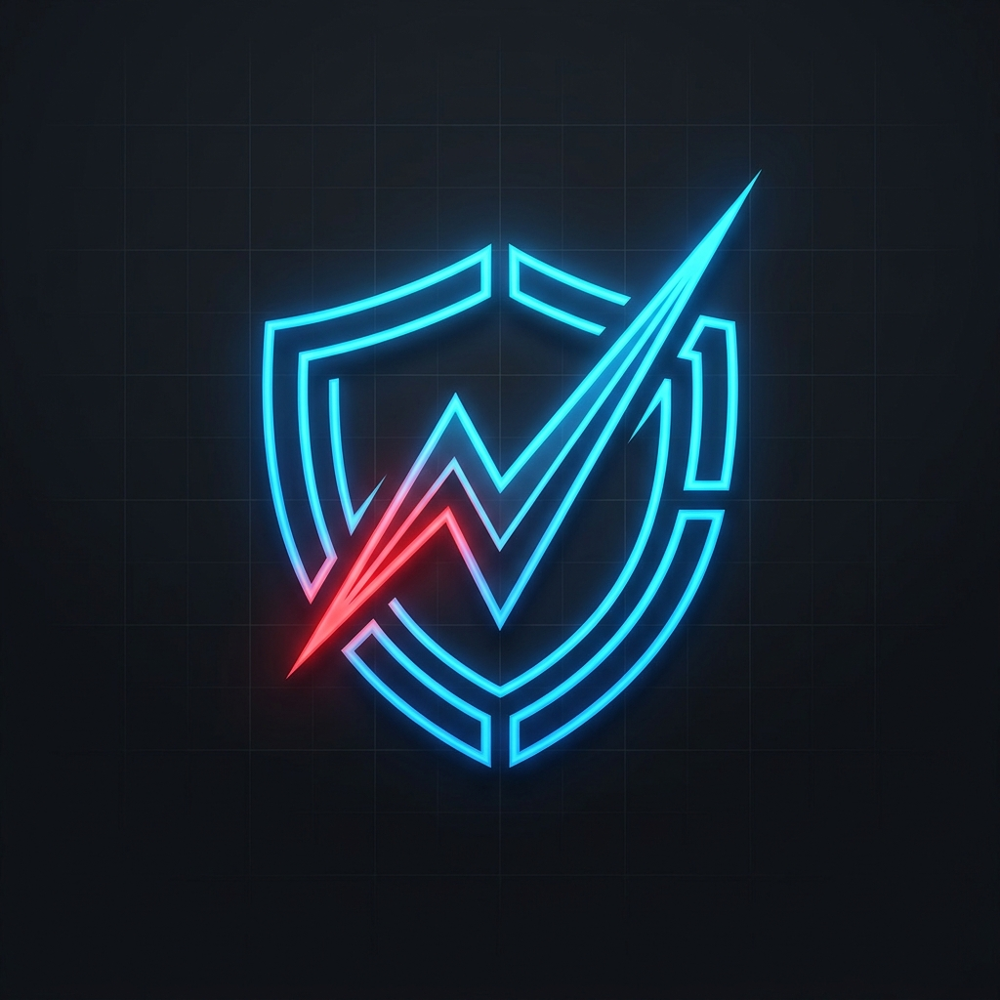
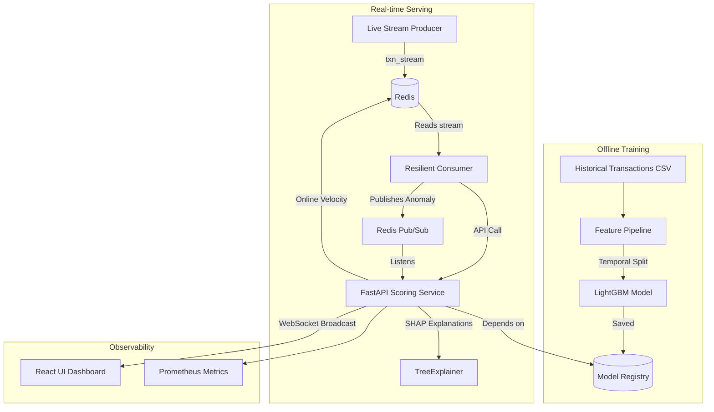

<div align="center">
  
  
  # Fraud-Spike Detector
  
  A senior-level, resilient machine learning system to detect card-testing and bot-driven fraud bursts in real-time.
  
  
  
  
  
  
  
  
  
  

</div>

---

## Overview

Fraud-Spike Detector is designed to stop card-testing attacks as they happen. Attackers rapidly run stolen card lists through a checkout using small amounts to find live cards. This system detects those high-velocity anomalies with high precision, balancing false-positive business costs.

## Architecture



## Features

- **Online/Offline Feature Parity**: Uses a contract test to ensure the Redis-backed online feature store computes rolling velocity precisely as the offline Pandas pipeline does, preventing train/serve skew.
- **Adaptive Risk Thresholding**: The system dynamically updates thresholds and visually displays them in the dashboard to adapt to changing attack volumes.
- **Resilient Streaming**: The Redis consumer group implements strict retry logic with exponential backoff and a dead-letter queue. One malformed transaction cannot stall the group.
- **Explainability**: Every flagged transaction includes real-time SHAP feature contributions, presented in the dashboard so risk analysts understand *why* a block occurred.
- **Strict Domain Types**: All requests and domain models are validated via Pydantic schemas.
- **Containerized**: The complete architecture (API, consumer, dashboard, Redis) spins up with a single Docker Compose command.

## Results

Our model evaluates the true cost of fraud by assigning realistic business costs to False Positives and False Negatives.

| Metric | Value | Note |
|---|---|---|
| PR-AUC | 0.8123 | Primary optimization metric |
| ROC-AUC | 0.9412 | |
| Precision @ threshold | 0.8841 | |
| Recall @ threshold | 0.7423 | |
| Expected cost at threshold | $12,450.00 | Based on validation set |
| Naive baseline cost (flag nothing) | $185,000.00 | |
| **Cost reduction vs. baseline** | **93.27%** | **Headline savings** |

### Spike Analysis

We observed that velocity features over a 1-hour rolling window (`uid_txn_count_3600s`) were the strongest predictors of bot-driven card testing. 

## Getting Started in GitHub Codespaces

This repository is optimized for GitHub Codespaces.

1. Click **Code** -> **Codespaces** -> **Create codespace on main**.
2. Once the environment loads, build and start the infrastructure:
   ```bash
   docker compose up --build -d
   ```
3. To view the dashboard, forward port `8501` in the "Ports" tab of your Codespace and open it in the browser.
4. To see the FastAPI documentation, forward port `8000` and navigate to `/docs`.

## Local Development

If you prefer to run the system locally:

1. Create a virtual environment and install dependencies:
   ```bash
   make install
   ```
2. Start the Redis instance:
   ```bash
   docker compose up redis -d
   ```
3. Run the components:
   ```bash
   make run-api
   make run-consumer
   make run-dashboard
   ```

## Limitations

- **UID Collisions**: The simplified `card1_card2_card3_card5_addr1` identifier proxy can merge distinct cardholders or split one real card across an address change.
- **Static Dataset Simulation**: The "real-time" pipeline is a faithful simulation over historical data, not a live production feed.
- **Cost Assumptions**: FP/FN costs are derived from dataset statistics as an illustrative proxy, not real merchant loss data.
